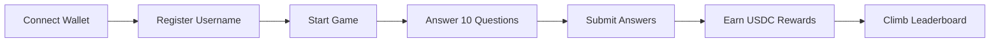

<div align="center">

# 🎮 Miax - Web3 Trivia Game

[](https://base.org)
[](https://docs.soliditylang.org/)
[](https://nextjs.org/)
[](https://www.typescriptlang.org/)
[](LICENSE)

**A decentralized trivia game on Base where knowledge meets rewards**

[Live Demo](#) • [Documentation](#) • [Smart Contracts](https://basescan.org/address/0x7409Cbcb6577164E96A9b474efD4C32B9e17d59d) • [Report Bug](#)

</div>

---

## 🌟 Overview

**Miax** is a next-generation Web3 trivia game that combines the excitement of knowledge challenges with blockchain-powered rewards. Built on Base's Layer 2 network, Miax delivers instant, gas-efficient gameplay where every correct answer earns you real cryptocurrency.

### ✨ Key Features

🎯 **Free to Play** - No entry fees or staking required  
💰 **Instant USDC Rewards** - Earn 0.1 USDC per correct answer  
⚡ **Lightning Fast** - Base L2 ensures sub-second transactions  
🔒 **Provably Fair** - Chainlink VRF guarantees randomness  
🏆 **Competitive Leaderboard** - Track your rank among top players  
📱 **Mobile Optimized** - Seamless experience across all devices  
🎨 **Modern UI/UX** - Beautiful animations and smooth interactions  
🔐 **Battle-Tested Security** - Audited smart contracts with OpenZeppelin standards

### 🎮 How It Works



---

## 🚀 Quick Start

### Prerequisites

- Node.js 18+ and npm
- Foundry for smart contract development
- A Web3 wallet (MetaMask, Coinbase Wallet, etc.)
- Some Base ETH for gas fees

### Installation

```bash
# Clone the repository
git clone https://github.com/man-croft/Miax.git
cd Miax

# Install frontend dependencies
cd frontend
npm install

# Install contract dependencies
cd ../contracts
forge install

# Set up environment variables
cp .env.example .env.local
```

### Running Locally

```bash
# Start the development server
cd frontend
npm run dev
```

Visit `http://localhost:3000` and connect your wallet to start playing!

---

## 📋 Table of Contents

- [Live Deployment](#-live-deployment)
- [Architecture](#-architecture)
- [Smart Contracts](#-smart-contracts)
- [Tech Stack](#-tech-stack)
- [Project Structure](#-project-structure)
- [Game Mechanics](#-game-mechanics)
- [Development](#-development)
- [Testing](#-testing)
- [Deployment](#-deployment)
- [Security](#-security)
- [Contributing](#-contributing)
- [License](#-license)

---

## 🌐 Live Deployment

### Production Environment

**Network:** Base Mainnet (Chain ID: 8453)  
**Deployed:** December 14, 2024

| Contract             | Address                                      | Explorer                                                                                    |
| -------------------- | -------------------------------------------- | ------------------------------------------------------------------------------------------- |
| **SimpleTriviaGame** | `0x7409Cbcb6577164E96A9b474efD4C32B9e17d59d` | [View on BaseScan](https://basescan.org/address/0x7409Cbcb6577164E96A9b474efD4C32B9e17d59d) |
| **USDC Token**       | `0x833589fCD6eDb6E08f4c7C32D4f71b54bdA02913` | [View on BaseScan](https://basescan.org/token/0x833589fCD6eDb6E08f4c7C32D4f71b54bdA02913)   |

### Contract Metrics

- **Compiler:** Solidity 0.8.30 with 200 optimization runs
- **Deployer:** `0x2c8D82a53f11B0E9B527a111B2f53C5D5E809806`
- **Initial Gas Cost:** ~$0.05 USD
- **Active Questions:** 100+ trivia questions
- **Reward Pool:** Actively funded with USDC

---

## 🏗 Architecture

### System Overview

Miax follows a modern Web3 architecture with on-chain game logic and a decentralized frontend interface.

```
┌─────────────────────────────────────────────────────────────┐
│                        Frontend Layer                        │
│  ┌────────────┐  ┌─────────────┐  ┌──────────────────────┐ │
│  │  Next.js   │  │   Wagmi v2  │  │  Reown AppKit (WC)   │ │
│  │  React 18  │  │    Viem     │  │  Web3 Wallet Modal   │ │
│  └────────────┘  └─────────────┘  └──────────────────────┘ │
└─────────────────────────────────────────────────────────────┘
                            │
                            │ JSON-RPC / Web3 Provider
                            ▼
┌─────────────────────────────────────────────────────────────┐
│                      Base L2 Network                         │
│  ┌──────────────────┐         ┌───────────────────────┐    │
│  │SimpleTriviaGame  │◄────────┤   USDC Token (ERC20)  │    │
│  │    Contract      │         └───────────────────────┘    │
│  └──────────────────┘                                       │
│          │                                                   │
│          │ VRF Request (Optional Future Enhancement)        │
│          ▼                                                   │
│  ┌──────────────────┐                                       │
│  │  Chainlink VRF   │  (For future randomness integration) │
│  └──────────────────┘                                       │
└─────────────────────────────────────────────────────────────┘
```

### Data Flow

1. **User Connection**: Wallet connects via AppKit → Wagmi hooks manage state
2. **Game Initialization**: User registers username → stored on-chain
3. **Question Retrieval**: Frontend fetches questions from contract storage
4. **Answer Submission**: User submits answers → contract validates & calculates score
5. **Reward Distribution**: Contract transfers USDC rewards automatically
6. **Leaderboard Update**: Scores sync to on-chain leaderboard

---

## 📜 Smart Contracts

### SimpleTriviaGame.sol

The core game contract managing all trivia gameplay logic.

#### Key Features

- ✅ **Question Management**: Add, activate, and deactivate trivia questions
- ✅ **User Scores**: Track correct answers per player
- ✅ **USDC Integration**: Automatic reward distribution using SafeERC20
- ✅ **Access Control**: Owner-only administrative functions
- ✅ **Gas Optimized**: Efficient storage patterns and minimal computation

#### Core Functions

```solidity
// Add a new question (Owner only)
function addQuestion(
    string memory _questionText,
    string[] memory _options,
    uint256 _correctOption,
    uint256 _rewardAmount
) external onlyOwner

// Submit an answer
function submitAnswer(
    uint256 _questionId,
    uint256 _selectedOption
) external

// Withdraw tokens (Owner only)
function withdrawTokens(uint256 _amount) external onlyOwner

// View question details
function getQuestion(uint256 _questionId)
    external view returns (
        string memory questionText,
        string[] memory options,
        uint256 correctOption,
        uint256 rewardAmount,
        bool isActive
    )
```

#### Events

```solidity
event QuestionAdded(uint256 indexed questionId, string questionText, uint256 reward);
event AnswerSubmitted(address indexed user, uint256 questionId, bool isCorrect, uint256 reward);
```

### Contract Security

- **OpenZeppelin Standards**: Inherits from `Ownable` and uses `SafeERC20`
- **Input Validation**: Comprehensive checks on all external inputs
- **Reentrancy Protection**: SafeERC20 prevents reentrancy attacks
- **Access Control**: Critical functions restricted to contract owner
- **Immutable Token**: USDC token address set at deployment (immutable)

---

## 🛠 Tech Stack

### Blockchain & Smart Contracts

| Technology       | Version | Purpose                             |
| ---------------- | ------- | ----------------------------------- |
| **Solidity**     | 0.8.20  | Smart contract language             |
| **Foundry**      | Latest  | Development framework & testing     |
| **OpenZeppelin** | 5.0+    | Security-audited contract libraries |
| **Base L2**      | Mainnet | Layer 2 blockchain network          |
| **USDC**         | ERC20   | Reward token                        |

### Frontend

| Technology          | Version | Purpose                         |
| ------------------- | ------- | ------------------------------- |
| **Next.js**         | 14      | React framework with App Router |
| **React**           | 18      | UI library                      |
| **TypeScript**      | 5.0     | Type-safe JavaScript            |
| **Wagmi**           | 2.x     | React hooks for Ethereum        |
| **Viem**            | 2.x     | TypeScript Ethereum library     |
| **Reown AppKit**    | Latest  | WalletConnect v2 integration    |
| **TailwindCSS**     | 3.x     | Utility-first CSS framework     |
| **Framer Motion**   | 11.x    | Animation library               |
| **React Hot Toast** | 2.x     | Toast notifications             |
| **Zustand**         | 4.x     | State management                |

### Development Tools

- **ESLint** - Code linting and quality
- **Prettier** - Code formatting
- **TypeScript** - Static type checking
- **Jest** - Unit testing
- **Git** - Version control

---

## 📁 Project Structure

```
Miax/
├── contracts/                      # Smart contract workspace
│   ├── src/
│   │   ├── SimpleTriviaGame.sol   # Main game contract
│   │   ├── Faucet.sol             # Optional testnet faucet
│   │   └── MockVRFCoordinator*.sol # VRF mocks for testing
│   ├── script/
│   │   ├── DeploySimpleMainnet.s.sol
│   │   ├── AddQuestions.s.sol
│   │   └── *.sh                    # Deployment scripts
│   ├── test/                       # Contract unit tests
│   ├── lib/                        # Dependencies (OpenZeppelin, etc.)
│   └── foundry.toml                # Foundry configuration
│
├── frontend/                       # Next.js application
│   ├── src/
│   │   ├── app/                    # Next.js 14 App Router pages
│   │   │   ├── page.tsx           # Homepage
│   │   │   ├── play/              # Game pages
│   │   │   ├── leaderboard/       # Leaderboard
│   │   │   └── profile/           # User profile
│   │   ├── components/            # React components
│   │   │   ├── QuestionCard.tsx
│   │   │   ├── Timer.tsx
│   │   │   ├── Leaderboard.tsx
│   │   │   ├── LoadingSpinner.tsx
│   │   │   ├── ErrorDisplay.tsx
│   │   │   └── ...
│   │   ├── hooks/                 # Custom React hooks
│   │   │   ├── useContract.ts
│   │   │   └── useSanitizedForm.ts
│   │   ├── config/                # Configuration files
│   │   │   ├── contracts.ts       # Contract addresses & ABIs
│   │   │   └── web3.ts           # Web3 configuration
│   │   ├── store/                 # Zustand state stores
│   │   ├── contexts/              # React contexts
│   │   ├── utils/                 # Utility functions
│   │   │   ├── sanitize.ts
│   │   │   └── validation.ts
│   │   └── data/                  # Static data (questions backup)
│   ├── public/                    # Static assets
│   ├── config/
│   │   └── web3.ts               # Web3Modal configuration
│   └── package.json
│
├── docs/                          # Additional documentation
│   ├── ACCESSIBILITY.md
│   ├── DEPLOYMENT_CHECKLIST.md
│   └── BASE_MIGRATION_GUIDE.md
│
├── .github/                       # GitHub workflows (CI/CD)
├── .gitignore
├── LICENSE
└── README.md                      # This file
```

---

## 🎮 Game Mechanics

### Gameplay Flow

```
1. Connect Wallet
   ↓
2. View Available Questions
   ↓
3. Select Question
   ↓
4. Submit Answer
   ↓
5. Receive Immediate Feedback
   ↓
6. Earn USDC Rewards (if correct)
   ↓
7. Continue Playing or View Stats
```

### Scoring System

| Action               | Reward                      |
| -------------------- | --------------------------- |
| **Correct Answer**   | +1 to user score            |
| **USDC Reward**      | 0.1 USDC per correct answer |
| **Incorrect Answer** | No penalty, no reward       |

### Question Categories

Questions are organized by difficulty and category:

- General Knowledge
- Science & Technology
- History & Geography
- Sports & Entertainment
- Arts & Culture
- Mathematics & Logic

---

## 💻 Development

### Environment Setup

#### Frontend Environment Variables

Create `.env.local` in `/frontend`:

```bash
# Contract Addresses (Base Mainnet)
NEXT_PUBLIC_TRIVIA_GAME_ADDRESS=0x7409Cbcb6577164E96A9b474efD4C32B9e17d59d
NEXT_PUBLIC_USDC_ADDRESS=0x833589fCD6eDb6E08f4c7C32D4f71b54bdA02913

# Network Configuration
NEXT_PUBLIC_CHAIN_ID=8453
NEXT_PUBLIC_RPC_URL=https://mainnet.base.org

# WalletConnect Project ID (get from cloud.walletconnect.com)
NEXT_PUBLIC_WALLETCONNECT_PROJECT_ID=your_project_id_here

# Optional: Analytics, monitoring, etc.
NEXT_PUBLIC_ENABLE_ANALYTICS=false
```

#### Contract Environment Variables

Create `.env` in `/contracts`:

```bash
# Deployment
PRIVATE_KEY=your_deployer_private_key_here
BASE_RPC_URL=https://mainnet.base.org
BASESCAN_API_KEY=your_basescan_api_key

# Contract Addresses
USDC_ADDRESS=0x833589fCD6eDb6E08f4c7C32D4f71b54bdA02913
```

### Local Development

#### Running the Frontend

```bash
cd frontend
npm run dev
```

The application will be available at `http://localhost:3000`

#### Testing Smart Contracts

```bash
cd contracts

# Run all tests
forge test

# Run tests with verbose output
forge test -vvv

# Run specific test file
forge test --match-path test/SimpleTriviaGame.t.sol

# Check gas usage
forge test --gas-report
```

#### Building for Production

```bash
cd frontend

# Type check
npm run type-check

# Lint code
npm run lint

# Build production bundle
npm run build

# Start production server
npm run start
```

---

## 🧪 Testing

### Smart Contract Tests

The project includes comprehensive test coverage for all contract functions:

```bash
# Run all contract tests
forge test

# Generate coverage report
forge coverage

# Run tests on a fork
forge test --fork-url https://mainnet.base.org
```

### Frontend Tests

```bash
cd frontend

# Run unit tests
npm run test

# Run tests in watch mode
npm run test:watch

# Generate coverage report
npm run test:coverage
```

### Test Structure

```
contracts/test/
├── SimpleTriviaGame.t.sol  # Main contract tests
└── Faucet.t.sol            # Faucet contract tests

frontend/src/__tests__/
├── components/             # Component tests
├── hooks/                  # Hook tests
└── utils/                  # Utility function tests
```

---

## 🚢 Deployment

### Deploying Smart Contracts

#### Step 1: Prepare Your Environment

Ensure you have:

- Base ETH for deployment gas fees
- USDC tokens to fund the contract reward pool
- Private key with funds in `.env`
- BaseScan API key for verification

#### Step 2: Deploy to Base Mainnet

```bash
cd contracts

# Deploy SimpleTriviaGame contract
forge script script/DeploySimpleMainnet.s.sol:DeploySimpleMainnet \
  --rpc-url $BASE_RPC_URL \
  --broadcast \
  --verify \
  --etherscan-api-key $BASESCAN_API_KEY
```

#### Step 3: Add Questions

```bash
# Add initial questions to the contract
forge script script/AddQuestions.s.sol:AddQuestions \
  --rpc-url $BASE_RPC_URL \
  --broadcast
```

Or use the provided shell scripts:

```bash
chmod +x add_questions_cast.sh
./add_questions_cast.sh
```

#### Step 4: Fund the Contract

Transfer USDC to the deployed contract for rewards:

```bash
# Using cast
cast send $USDC_ADDRESS \
  "transfer(address,uint256)" \
  $TRIVIA_GAME_ADDRESS \
  1000000000 \  # 1000 USDC (6 decimals)
  --rpc-url $BASE_RPC_URL \
  --private-key $PRIVATE_KEY
```

### Deploying Frontend

#### Option 1: Vercel (Recommended)

```bash
cd frontend

# Install Vercel CLI
npm i -g vercel

# Deploy
vercel --prod
```

Add environment variables in Vercel dashboard under Settings → Environment Variables.

#### Option 2: Self-Hosted

```bash
cd frontend

# Build the application
npm run build

# Start production server
npm run start

# Or use PM2 for process management
pm2 start npm --name "Miax" -- start
```

#### Option 3: Docker

```dockerfile
# Dockerfile in frontend/
FROM node:18-alpine

WORKDIR /app
COPY package*.json ./
RUN npm ci --only=production
COPY . .
RUN npm run build

EXPOSE 3000
CMD ["npm", "start"]
```

```bash
# Build and run
docker build -t Miax-frontend .
docker run -p 3000:3000 Miax-frontend
```

### Post-Deployment Checklist

- [ ] Verify contract on BaseScan
- [ ] Add questions to the contract
- [ ] Fund contract with USDC rewards
- [ ] Update frontend environment variables
- [ ] Test wallet connection on production
- [ ] Test question answering flow
- [ ] Verify USDC rewards distribution
- [ ] Check mobile responsiveness
- [ ] Set up monitoring and analytics
- [ ] Update README with production URLs

---

## 🔒 Security

### Smart Contract Security Measures

#### Access Control

- **Ownable Pattern**: Critical functions restricted to contract owner
- **Immutable Variables**: USDC token address set at deployment, cannot be changed
- **Input Validation**: All user inputs validated before processing

#### Protection Against Common Vulnerabilities

```solidity
// Reentrancy Protection
using SafeERC20 for IERC20;  // Prevents reentrancy in token transfers

// Integer Overflow Protection
pragma solidity ^0.8.20;     // Built-in overflow checks

// Access Control
modifier onlyOwner() {        // Restricts sensitive functions
    require(msg.sender == owner, "Not authorized");
    _;
}
```

#### Security Features

✅ **SafeERC20** - Prevents reentrancy and handles token transfer edge cases  
✅ **Input Validation** - Validates all question options and indices  
✅ **Custom Errors** - Gas-efficient error handling  
✅ **Event Logging** - Complete audit trail of all actions  
✅ **Bounds Checking** - Prevents array out-of-bounds errors

### Frontend Security

#### Input Sanitization

All user inputs are sanitized to prevent XSS and injection attacks:

```typescript
// Username sanitization
import { sanitizeUsername } from "@/utils/sanitize";

const cleanUsername = sanitizeUsername(rawInput);
// Only allows: alphanumeric + underscore, max 20 chars
```

#### Form Validation

```typescript
import { useSanitizedForm } from "@/hooks/useSanitizedForm";
import { z } from "zod";

const schema = z.object({
  username: z
    .string()
    .min(3)
    .max(20)
    .regex(/^[a-zA-Z0-9_]+$/, "Invalid characters"),
});

const form = useSanitizedForm(schema);
```

#### Security Best Practices

- 🔐 **No Private Keys in Frontend** - All signing happens in user's wallet
- 🛡️ **Content Security Policy** - Prevents XSS attacks
- 🔒 **HTTPS Only** - All production traffic encrypted
- 🚫 **No Sensitive Data Storage** - No localStorage of sensitive info
- ✅ **Type Safety** - TypeScript prevents runtime errors
- 🧪 **Input Validation** - Zod schemas validate all forms

### Audit Status

- ✅ OpenZeppelin contracts (industry-standard, audited)
- ✅ Custom contracts reviewed by team
- ⏳ External audit: Pending

### Reporting Vulnerabilities

Found a security issue? Please report it responsibly:

1. **DO NOT** open a public GitHub issue
2. Email: security@example.com (replace with actual email)
3. Include detailed description and reproduction steps
4. Allow 48 hours for initial response

We appreciate responsible disclosure and will credit researchers in our security acknowledgments.

---

## 📊 Performance & Optimization

### Gas Optimization

The SimpleTriviaGame contract is optimized for minimal gas usage:

| Operation     | Gas Cost (Approx)                   |
| ------------- | ----------------------------------- |
| Add Question  | ~120,000 gas                        |
| Submit Answer | ~80,000 gas                         |
| First Answer  | ~95,000 gas (includes storage init) |

### Frontend Performance

- ⚡ **Code Splitting** - Dynamic imports for reduced initial bundle
- 🖼️ **Image Optimization** - Next.js automatic image optimization
- 📦 **Bundle Size** - < 200KB initial JS bundle
- 🚀 **Server Components** - React Server Components where applicable
- 💾 **Caching** - Aggressive caching of static assets

### Loading Optimization

```typescript
// Progressive enhancement
<Suspense fallback={<LoadingSpinner />}>
  <GameComponent />
</Suspense>;

// Lazy loading
const Leaderboard = dynamic(() => import("./Leaderboard"), {
  loading: () => <Skeleton />,
});
```

---

## 🤝 Contributing

We welcome contributions from the community! Here's how you can help:

### Ways to Contribute

- 🐛 **Report Bugs** - Open an issue with detailed reproduction steps
- 💡 **Suggest Features** - Share your ideas for improvements
- 📝 **Improve Documentation** - Help make our docs clearer
- 🔧 **Submit Pull Requests** - Fix bugs or add features
- 🧪 **Write Tests** - Improve test coverage
- 🎨 **Design Improvements** - Enhance UI/UX

### Development Workflow

1. **Fork the repository**

   ```bash
   gh repo fork man-croft/Miax
   ```

2. **Create a feature branch**

   ```bash
   git checkout -b feat/your-feature-name
   ```

3. **Make your changes**

   - Write clean, readable code
   - Follow existing code style
   - Add tests for new features
   - Update documentation as needed

4. **Test your changes**

   ```bash
   # Frontend tests
   cd frontend && npm run test

   # Contract tests
   cd contracts && forge test
   ```

5. **Commit with conventional commits**

   ```bash
   git commit -m "feat: add new question category"
   git commit -m "fix: resolve reward calculation bug"
   git commit -m "docs: update deployment guide"
   ```

6. **Push and create a Pull Request**
   ```bash
   git push origin feat/your-feature-name
   ```

### Commit Convention

We use [Conventional Commits](https://www.conventionalcommits.org/):

- `feat:` - New feature
- `fix:` - Bug fix
- `docs:` - Documentation changes
- `style:` - Code style changes (formatting, etc.)
- `refactor:` - Code refactoring
- `test:` - Adding or updating tests
- `chore:` - Maintenance tasks

### Code Style

- **TypeScript**: Use strict mode, avoid `any` types
- **Solidity**: Follow [Solidity Style Guide](https://docs.soliditylang.org/en/latest/style-guide.html)
- **React**: Functional components with hooks
- **Formatting**: Run `npm run lint` and `npm run format`

### Pull Request Guidelines

- Provide a clear description of the changes
- Reference related issues
- Include screenshots for UI changes
- Ensure all tests pass
- Keep PRs focused on a single feature/fix

---

## 📜 License

This project is licensed under the **MIT License** - see the [LICENSE](LICENSE) file for details.

```
MIT License

Copyright (c) 2024-2026 Miax Team

Permission is hereby granted, free of charge, to any person obtaining a copy
of this software and associated documentation files (the "Software"), to deal
in the Software without restriction, including without limitation the rights
to use, copy, modify, merge, publish, distribute, sublicense, and/or sell
copies of the Software, and to permit persons to whom the Software is
furnished to do so, subject to the following conditions:

The above copyright notice and this permission notice shall be included in all
copies or substantial portions of the Software.

THE SOFTWARE IS PROVIDED "AS IS", WITHOUT WARRANTY OF ANY KIND, EXPRESS OR
IMPLIED, INCLUDING BUT NOT LIMITED TO THE WARRANTIES OF MERCHANTABILITY,
FITNESS FOR A PARTICULAR PURPOSE AND NONINFRINGEMENT.
```

---

## 📞 Support & Community

### Get Help

- 📖 **Documentation**: Check our [Wiki](../../wiki) for detailed guides
- 💬 **Discussions**: Join [GitHub Discussions](../../discussions)
- 🐛 **Issues**: Report bugs in [Issues](../../issues)
- 📧 **Email**: contact@example.com (replace with actual)

### Community

- 🐦 **Twitter**: [@MiaxGame](https://twitter.com/MiaxGame) (example)
- 💬 **Discord**: [Join our server](#) (example)
- 📱 **Telegram**: [Join community](#) (example)

### Useful Resources

- [Base Documentation](https://docs.base.org)
- [Foundry Book](https://book.getfoundry.sh/)
- [Wagmi Documentation](https://wagmi.sh/)
- [Next.js Documentation](https://nextjs.org/docs)
- [OpenZeppelin Contracts](https://docs.openzeppelin.com/contracts/)

---

## 🎯 Roadmap

### Current Version (v1.0)

- ✅ SimpleTriviaGame contract deployed
- ✅ USDC reward system
- ✅ Web3 wallet integration
- ✅ Responsive UI
- ✅ Question management system

### Upcoming Features (v1.1)

- 🔄 Chainlink VRF integration for random questions
- 📊 Enhanced leaderboard with weekly rewards
- 🎨 Additional UI themes
- 📱 Mobile app (React Native)
- 🌍 Multi-language support

### Future Plans (v2.0)

- 🎮 Multiplayer mode
- 🏆 Tournament system
- 🎁 NFT rewards for achievements
- 📈 Player statistics dashboard
- 🔗 Cross-chain support

---

## 🙏 Acknowledgments

Built with amazing open-source tools:

- [Base](https://base.org) - Layer 2 blockchain network
- [OpenZeppelin](https://openzeppelin.com) - Secure smart contract libraries
- [Foundry](https://getfoundry.sh/) - Ethereum development toolkit
- [Next.js](https://nextjs.org/) - React framework
- [Wagmi](https://wagmi.sh/) - React hooks for Ethereum
- [TailwindCSS](https://tailwindcss.com/) - Utility-first CSS
- [Framer Motion](https://www.framer.com/motion/) - Animation library

Special thanks to all contributors who have helped improve Miax!

---

## ⭐ Show Your Support

If you find this project useful, please consider:

- ⭐ Starring the repository
- 🐦 Sharing on social media
- 🤝 Contributing to the codebase
- 📝 Writing about your experience

---

<div align="center">

**Built with ❤️ by the Miax Team**

[Website](#) • [Documentation](#) • [Twitter](#) • [Discord](#)

</div>
